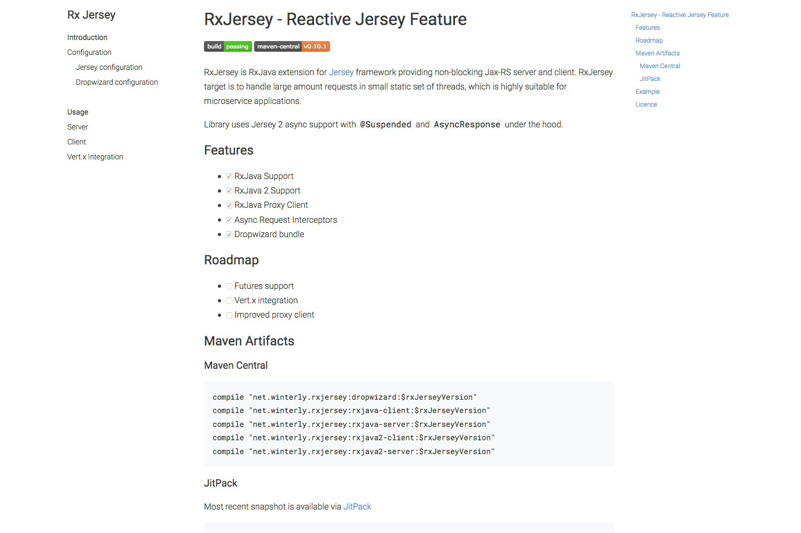

# Hugo Book Theme
### [Hugo](https://gohugo.io) documentation theme as simple as plain book



## Features
* Clean simple design
* Mobile friendly
* Customizable
* Designed to not interfere with main website
* Zero initial configuration

## Installation
Navigate to your hugo website root and run:
```
git clone git@github.com:alex-shpak/hugo-book.git themes/book
```

Then run hugo (or set `theme: book` in configuration file)
```
hugo server --theme book
```

## Configuration
### File tree menu (default)
By default theme will render pages from `content/docs` section as menu in a tree structure.  
You can set `title` and `weight` in front matter of pages to adjust order and titles in menu.


### Leaf bundle menu
You can also use leaf bundle and content of it's `index.md` as 
menu.  
Enable it by pointing to leaf bundle with `BookMenuBundle` parameter on Site level.  
- [Example menu](exampleSite/content/menu)
- [Example config file](exampleSite/config.yml)
- [Leaf bundles](https://gohugo.io/content-management/page-bundles/)


### Site configuration
There are few configuration options you can add to your `config.yml|json|toml` file
```yaml
# (Optional) Set this to true if you use captial letters in file names
disablePathToLower: true

params:
  # (Optional, default true) Show or hide table of contents globally
  # You can also specify this parameter per page in front matter
  BookShowToC: true

  # (Optional, default none) Set leaf bundle to render side menu
  # When not specified file structure and weights will be used
  # See https://gohugo.io/content-management/page-bundles/
  BookMenuBundle: /docs/menu

  # (Optional, default docs) Specify section of content to render as menu
  # You can also set value to "*" to render all sections to menu
  BookSection: docs
```


### Per document configuration
You can specify additional params per document in front matter
```yaml
---
# Set type to 'docs' if you want to render page outside of configured section
type: docs

# Set page weight to re-arrange items in file-tree menu (if BookMenuBundle not set)
weight: 10

# Set to mark page as top level section in file-tree menu (if BookMenuBundle not set)
bookTopSection: true

# Set to hide table of contents, overrides global value
bookShowToC: false
---
```

### Partials
There are few empty partials you can override in `layouts/partials/`

| Partial                                      | Placement                     |
| --                                           | --                            |
| layouts/partials/docs/inject/head.html       | Before closing `<head>` tag   |
| layouts/partials/docs/inject/body.html       | Before closing `<body>` tag   |
| layouts/partials/docs/inject/nav-before.html | Before `<nav>` menu block     |
| layouts/partials/docs/inject/nav-after.html  | After `<nav>` menu block      |


## Contributing
Contributions are welcome and I will review and consider pull requests.  
Primary goals are:
 - Keep it simple
 - Keep minimal (or zero) default configuration
 - Avoid interference with user-defined layouts

If you missing some configuration or customisation option feel free to open issue.

## License
[MIT](LICENSE)