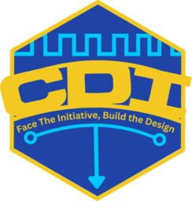

<p align="center">
  
</p>

<h1 align="center">CDI Grimoire</h1>

<p align="center">
  The <a href="https://github.com/cdi-sjsu">Chip Design Initiative @ SJSU</a> docs site.<br>
  <em>Face The Initiative, Build the Design.</em>
</p>

<p align="center">
  <a href="https://cdi-sjsu.github.io/grimoire/">cdi-sjsu.github.io/grimoire</a>
</p>

## Running it

```sh
direnv allow    # once per clone, then the shell loads itself from .envrc
hugo server     # http://localhost:1313/grimoire/
```

No direnv yet? `nix develop` does the same thing by hand.

No nix on your machine yet? The [Development Environment](https://cdi-sjsu.github.io/grimoire/docs/devenv/) docs cover Linux, macOS and Windows (WSL, systemd and all), and then [how .envrc works](https://cdi-sjsu.github.io/grimoire/docs/devenv/envrc/).

Without nix, any Hugo 0.158+ works: `hugo server`.

## Writing

Markdown files under `content/docs/`. Folders are sections and need an `_index.md`, `weight` sorts them, the sidebar builds itself.

```md
---
title: Writing an FSM
weight: 10
---

# Writing an FSM
```

More on how the sidebar and front matter work in the [hugo-book docs](https://github.com/alex-shpak/hugo-book).

## Publishing

Push to `main`. Github Actions builds it with the same nix shell and deploys to Pages.

## Layout

```
content/          the words
assets/styles/    css, custom.css is the safe one to edit
static/           logo, favicons, mermaid, katex
layouts/          templates
hugo.toml         title, menu, every knob
flake.nix         the dev shell
```

## Credits

Built on [hugo-book](https://github.com/alex-shpak/hugo-book) by Alex Shpak, MIT licensed, forked and rebranded for CDI.
