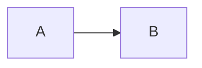

# Mermaid

Render diagrams and charts with [Mermaid](https://mermaid.js.org/). The library is loaded automatically on first use.

Diagram theme follows the site theme through the `--mermaid-theme` CSS variable. Override it in `assets/styles/custom.css` to use another [Mermaid theme](https://mermaid.js.org/config/theming.html).

> [!TIP]
> Override Mermaid initialization by creating `assets/mermaid.json` in your project. A `theme` set there takes precedence over the CSS variable.

## Syntax

Use fenced code blocks (recommended) or the shortcode

````tpl

````

```tpl

graph LR
    A --> B

```

## Examples

{}

- ```mermaid
  flowchart TD
      A[Content Files] --> B[Hugo Build]
      B --> C[HTML Output]
      B --> D[Search Index]
      B --> E[RSS Feed]
  ```

  ```mermaid
  sequenceDiagram
      Browser->>Hugo: Request page
      Hugo->>Theme: Apply template
      Theme->>Browser: Rendered HTML
      Browser->>Browser: Load shortcodes
  ```

- ```mermaid
  pie title Theme Assets
      "SCSS" : 8
      "HTML Templates" : 30
      "JavaScript" : 3
      "i18n Files" : 35
  ```

  ```mermaid
  gitGraph
     commit id: "init"
     commit id: "add theme"
     branch feature
     checkout feature
     commit id: "add docs"
     commit id: "add config"
     checkout main
     merge feature
     commit id: "deploy"
  ```

{}

Explore more diagram types on the [Mermaid documentation](https://mermaid.js.org/syntax/flowchart.html).
