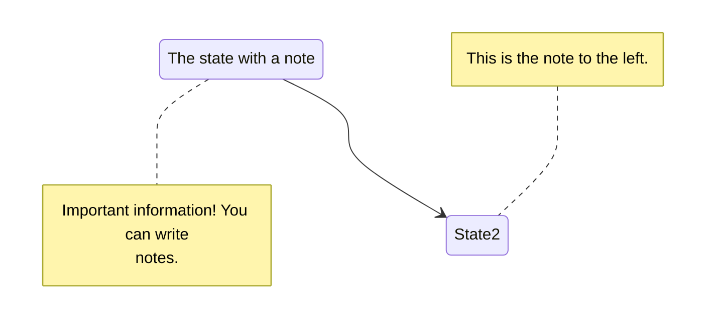
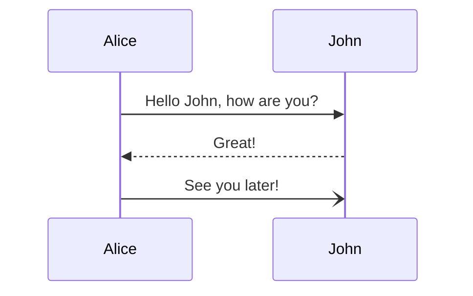
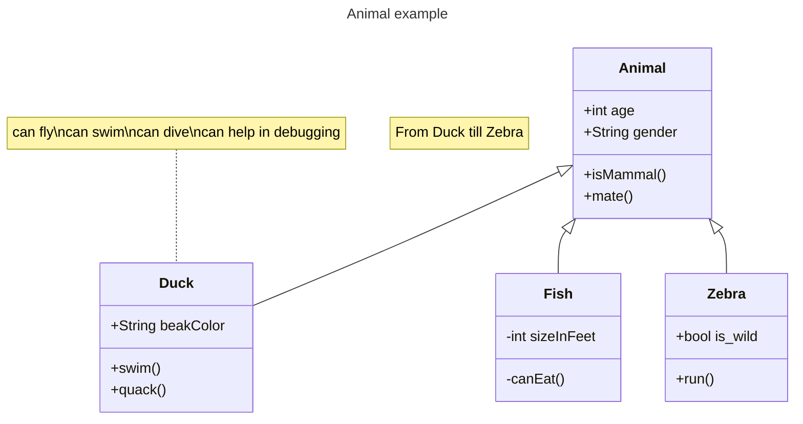
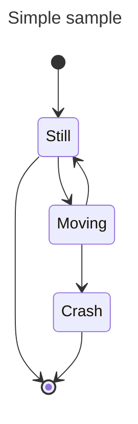
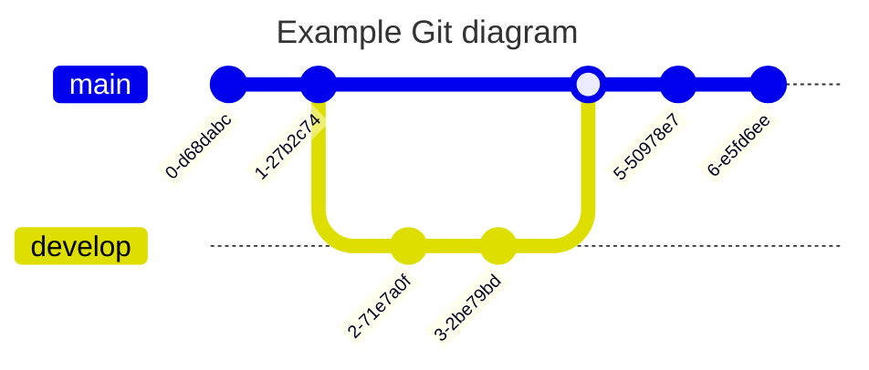
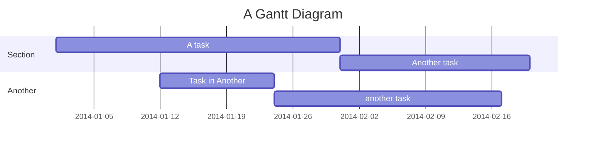
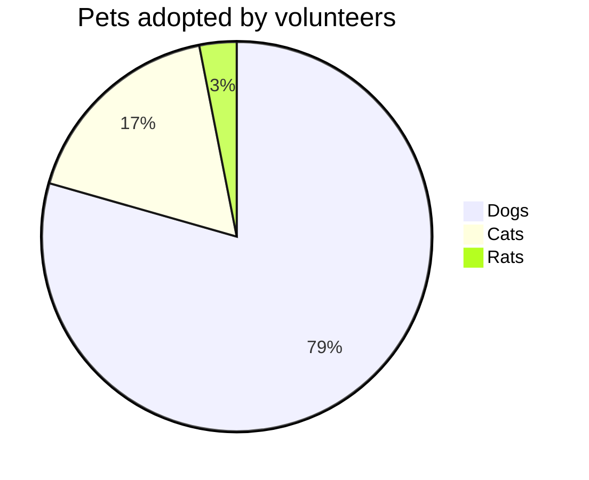
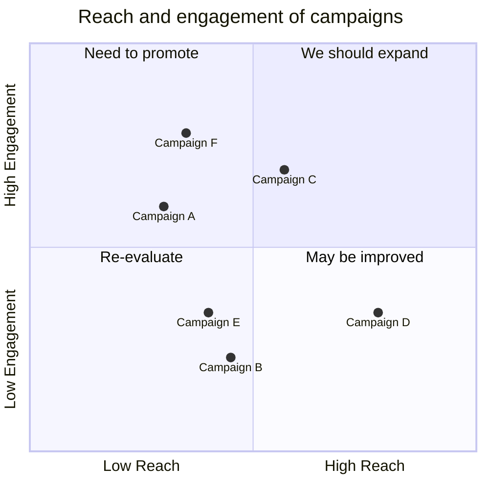

# Mermaid Chart

[MermaidJS](https://mermaid-js.github.io/) is library for generating svg charts and diagrams from text.

{}
**Override Mermaid initialization config**  
To override the [initialization config](https://mermaid-js.github.io/mermaid/#/Setup) for Mermaid,
create a `mermaid.json` file in your `assets` folder!
{}

## Example

{}
- ````tpl
  ```mermaid
  stateDiagram-v2
      State1: The state with a note
      note right of State1
          Important information! You can write
          notes.
      end note
      State1 --> State2
      note left of State2 : This is the note to the left.
  ```
  ````

- ```mermaid
  stateDiagram-v2
      State1: The state with a note
      note right of State1
          Important information! You can write
          notes.
      end note
      State1 --> State2
      note left of State2 : This is the note to the left.
  ```
{}

{}
- ```tpl
  
  stateDiagram-v2
      State1: The state with a note
      note right of State1
          Important information! You can write
          notes.
      end note
      State1 --> State2
      note left of State2 : This is the note to the left.
  
  ```

- 
  stateDiagram-v2
      State1: The state with a note
      note right of State1
          Important information! You can write
          notes.
      end note
      State1 --> State2
      note left of State2 : This is the note to the left.
  
{}

## Diagrams
Explore more diagrams and syntax on Mermaid [documentation page](https://mermaid.js.org/syntax/flowchart.html).

{}









<--->









{}